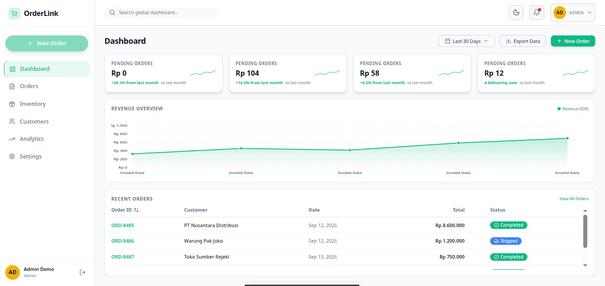
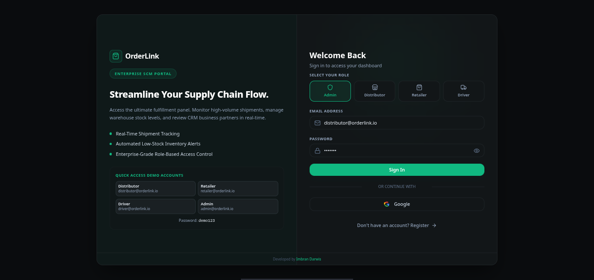

<p align="center">
  
</p>

<h1 align="center">🛒 OrderLink</h1>

<p align="center">
  <b>Enterprise Real-time Order Management & Logistics Platform</b>
</p>

<p align="center">
  <a href="#-tech-stack">
    
  </a>
  <a href="#-tech-stack">
    
  </a>
  <a href="#-tech-stack">
    
  </a>
  <a href="#-tech-stack">
    
  </a>
  <a href="#-tech-stack">
    
  </a>
  <a href="#-tech-stack">
    
  </a>
</p>

<p align="center">
  
  
  
  
</p>

---

## ✨ Fitur Utama

| Fitur | Deskripsi |
| :--- | :--- |
| ⚡ **Real-time Order Tracking** | Pembaruan status pesanan secara langsung via Supabase Realtime |
| 🔐 **Multi-Role Authentication** | Sistem login berbasis peran (Distributor, Retailer, Driver) dengan Supabase Auth |
| 🛡️ **Row Level Security** | Proteksi data granular — setiap role hanya mengakses data yang relevan |
| 📊 **Dashboard Analytics** | Statistik pesanan, revenue, dan performa logistik real-time |
| 📦 **Manajemen Inventori** | Pelacakan stok produk terintegrasi dengan sistem pesanan |
| 👥 **Customer Management** | Pengelolaan data pelanggan dan riwayat transaksi |
| 🌐 **Multi-Language** | Dukungan bahasa Indonesia & English |
| 💰 **Multi-Currency** | Format mata uang IDR & USD |

---

## 📸 Screenshots

<p align="center">
  
  <br/>
  <em>Login Page — Supabase Auth dengan dukungan Google OAuth</em>
</p>

<p align="center">
  
  <br/>
  <em>Dashboard — Real-time metrics, chart analytics, dan order management</em>
</p>

---

## 🏗️ Arsitektur

```
┌─────────────────────────────────────────────────────────┐
│                      CLIENT                             │
│  React 19 + TypeScript + Tailwind CSS + Vite            │
│  Deployed on Vercel                                     │
└───────────────┬─────────────────────┬───────────────────┘
                │ REST API            │ Realtime
                │ (supabase-js)       │ (WebSocket)
                ▼                     ▼
┌─────────────────────────────────────────────────────────┐
│                    SUPABASE                              │
│  ┌──────────┐  ┌──────────┐  ┌───────────────────────┐  │
│  │   Auth   │  │ Realtime │  │   PostgreSQL + RLS    │  │
│  │  (JWT)   │  │ (Changes)│  │  (Row Level Security) │  │
│  └──────────┘  └──────────┘  └───────────────────────┘  │
│  ┌──────────────────────────────────────────────────┐   │
│  │         Edge Functions (Business Logic)           │   │
│  └──────────────────────────────────────────────────┘   │
└─────────────────────────────────────────────────────────┘
```

---

## 🛠️ Tech Stack

<div align="center">

| Layer | Teknologi |
| :--- | :--- |
| **Frontend** | React 19, TypeScript, Tailwind CSS 4, Vite 7 |
| **Auth** | Supabase Auth (JWT + Google OAuth) |
| **Database** | PostgreSQL (Supabase) + Row Level Security |
| **Realtime** | Supabase Realtime (Postgres Changes) |
| **Business Logic** | Supabase Edge Functions (Deno) |
| **Deployment** | Vercel (Frontend), Supabase (Backend) |
| **Animation** | Framer Motion |
| **Icons** | Lucide React |

</div>

---

## 🚀 Getting Started

### Prasyarat

- **Node.js** `v18.x` atau lebih baru
- **npm** `v9.x` atau lebih baru
- **Supabase CLI** (opsional, untuk local development)

### 1. Clone Repositori

```bash
git clone https://github.com/ImbranDarwis/orderlink.git
cd orderlink
```

### 2. Install Dependensi

```bash
npm install
```

### 3. Konfigurasi Environment

```bash
cp .env.example .env.local
```

Edit `.env.local` dan isi dengan kredensial Supabase Anda:

```env
VITE_SUPABASE_URL=https://your-project.supabase.co
VITE_SUPABASE_ANON_KEY=your-supabase-anon-key
VITE_GOOGLE_CLIENT_ID=your-google-client-id          # opsional
```

> **⚠️ Penting:** Jangan pernah commit file `.env.local` — file ini sudah tercakup di `.gitignore`.

### 4. Setup Database

Jalankan migrasi SQL di Supabase Dashboard (SQL Editor) atau via CLI:

```bash
npx supabase db push
```

### 5. Jalankan Development Server

```bash
npm run dev
```

Buka `http://localhost:5173` di browser.

---

## 📁 Struktur Project

```
orderlink/
├── public/
│   └── screenshots/        # Screenshot untuk README
├── src/
│   ├── components/          # Reusable UI components
│   ├── contexts/            # React Context (Auth, Theme)
│   ├── lib/                 # Supabase client, utilities
│   ├── pages/               # Page components (Login, Dashboard)
│   └── services/            # API service layer
├── supabase/
│   ├── config.toml          # Supabase local config
│   └── migrations/          # SQL migration files
├── .env.example             # Template environment variables
├── package.json
├── vite.config.ts
└── vercel.json              # Vercel deployment config
```

---

## 🔐 Keamanan

- **Row Level Security (RLS)** aktif di semua tabel — setiap role hanya mengakses data yang diizinkan
- **Supabase Auth** mengelola JWT signing dan session management
- **`anon` key** aman di frontend karena dilindungi RLS
- **`service_role` key** hanya digunakan di Edge Functions (server-side)
- **Environment variables** tidak pernah di-commit ke repository
- **Pre-commit hooks** (Husky + gitleaks) mencegah kebocoran credential

---

## 📜 Scripts

| Command | Deskripsi |
| :--- | :--- |
| `npm run dev` | Jalankan development server |
| `npm run build` | Build untuk production |
| `npm run preview` | Preview production build |
| `npm run lint` | Jalankan ESLint |

---

## 🤝 Contributing

1. Fork repositori ini
2. Buat branch fitur (`git checkout -b feat/fitur-baru`)
3. Commit perubahan (`git commit -m "feat: tambah fitur baru"`)
4. Push ke branch (`git push origin feat/fitur-baru`)
5. Buat Pull Request

---

## 📄 License & Hak Cipta

Copyright © 2026 Imbran Darwis. **All Rights Reserved.**

Seluruh kode, aset desain, dan dokumentasi dalam repositori ini adalah milik eksklusif Imbran Darwis. Dilarang menyalin, mendistribusikan, memodifikasi, atau menggunakan kembali sebagian maupun seluruh isi proyek ini untuk keperluan komersial maupun non-komersial tanpa izin tertulis eksplisit dari pemilik hak cipta.

---

<p align="center">
  Developed with ❤️ by <a href="https://github.com/ImbranDarwis">Imbran Darwis</a>
</p>
